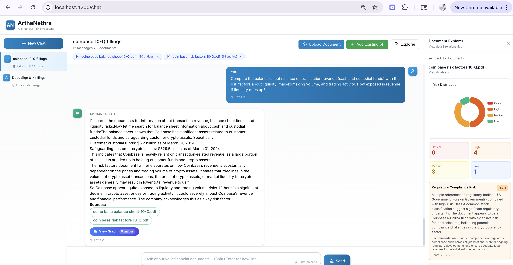
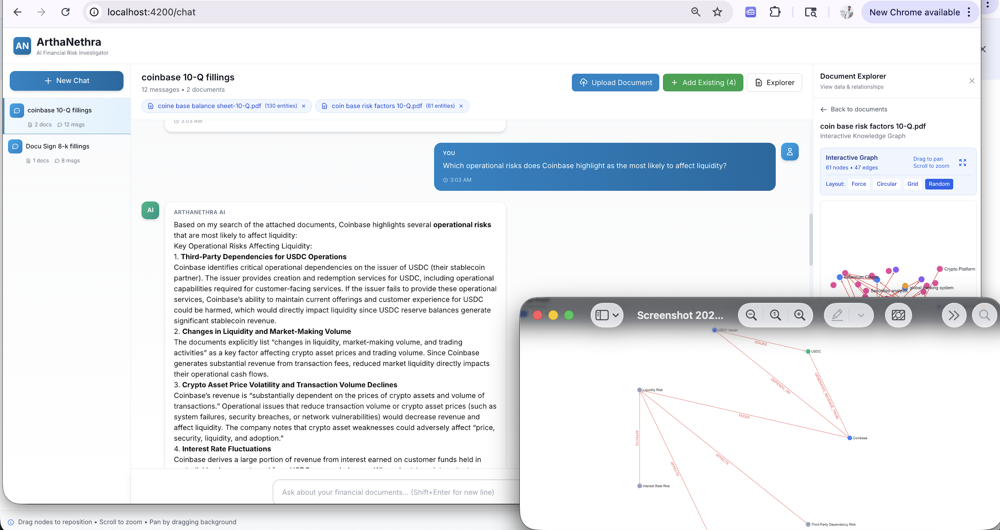
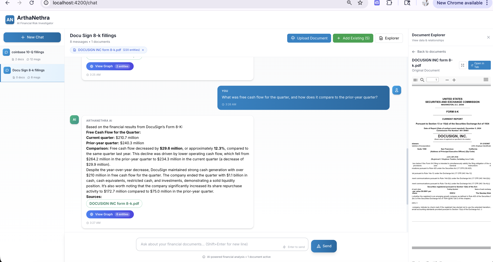

# 🧠 ArthaNethra — AI Financial Risk Investigator

> *"Turning complex financial documents into connected, explainable insights."*

[](#-license)
[](https://www.python.org/)
[](https://angular.io/)
[](https://aws.amazon.com/bedrock/)
[](https://landing.ai/)

## 📺 Demo Video

🎥 **[Watch Full Demo on YouTube](https://youtu.be/QdXCNYUUAPg)**

---

## 🌟 Introduction

**ArthaNethra** (Sanskrit: "Artha" = wealth, "Nethra" = eye) is the **first knowledge graph-native financial investigation platform**. Unlike traditional document analysis tools that extract data in isolation, ArthaNethra automatically maps **entities and relationships across multiple documents** into an interactive graph database, revealing hidden patterns and connections that humans miss.

### Why We Built This

Financial analysts waste **200+ hours per deal** manually reviewing documents, copy-pasting data into spreadsheets, and hunting for hidden risks. Traditional tools either:
- Extract data but don't connect relationships
- Analyze single documents but can't cross-reference
- Provide AI insights without explaining where they came from

**ArthaNethra solves all three problems in one workflow.**

---

## ❓ The Problem

### Pain Points in Financial Document Analysis

| Problem | Current Reality | Impact |
|---------|-----------------|--------|
| **Manual Review** | Analysts spend weeks reading 1000s of pages | 200+ hours per M&A deal |
| **Fragmented Tools** | Separate systems for contracts, invoices, filings | Data silos, no unified view |
| **Hidden Risks** | Covenants, conflicts buried in fine print | Missed risks discovered too late |
| **No Traceability** | AI tools give scores without explanations | Can't defend findings in audits |
| **Repetitive Grunt Work** | Copy-pasting data, reconciling invoices | Low-value work for expensive talent |

### Who Suffers?
- 🏦 **Financial Analysts** — drowning in PDF reviews
- 📊 **Risk Managers** — can't monitor loan covenants at scale
- ⚖️ **Compliance Teams** — weeks to gather audit evidence
- 💼 **Private Equity Firms** — due diligence bottleneck limits deal flow
- 🏢 **Procurement Teams** — invoice fraud goes undetected

---

## ✅ The Solution

### How ArthaNethra Solves It

1. **Hybrid AI Extraction**
   - LandingAI ADE extracts structured data (tables, forms, invoices)
   - Claude Haiku parses narratives (10-K sections, contract clauses)
   - **Result**: 99% accuracy at 80% lower cost than pure LLM approaches

2. **Knowledge Graph Intelligence**
   - Automatically builds graph with entities and relationships
   - Connects entities **across documents** (Invoice → Contract → Vendor → Subsidiary)
   - **Result**: Find patterns humans can't see (e.g., "all loans to subsidiaries with no collateral")

3. **Explainable AI Chatbot**
   - Natural language Q&A: "Which vendors have late payments?"
   - Every answer includes clickable citations to source PDFs
   - **Result**: 10x faster insights with audit-defensible evidence

4. **Interactive Visualization**
   - Graph explorer with zoom, pan, filter, layout switching
   - AI-generated subgraphs from chat responses
   - **Result**: Visual discovery of complex relationships

---

## 🎯 Core Innovation: Knowledge Graph Intelligence

Traditional tools answer: *"What is the debt ratio?"*  
**ArthaNethra answers:** *"What is the debt ratio, who are the lenders, which subsidiaries guarantee the loans, what collateral secures them, and how are they interconnected?"*

### Our Unique Approach

- 🕸️ **Graph-First Architecture**: Neo4j + Weaviate dual-database design for entity relationships + semantic search
- 🔗 **Cross-Document Intelligence**: Automatically connects Invoice → Contract → Vendor → Subsidiary → Parent Company across separate files
- 📊 **Interactive Visualization**: Sigma.js graph with 4 layout algorithms - drag nodes, explore connections visually
- 🤖 **Hybrid Relationship Detection**: LLM-based + heuristic methods to extract complex financial relationships (OWNS, SUBSIDIARY_OF, HAS_LOAN, INVESTED_IN, REGULATED_BY)
- 💬 **Graph-Augmented Chat**: AI queries both document content AND relationship graph for comprehensive answers
- 🎨 **Multi-Document Sessions**: Maintain context across 10-Ks, 10-Qs, 8-Ks, contracts, invoices simultaneously in one conversation

### Why Knowledge Graphs Change Everything

**Problem**: Analyst asks *"Which subsidiaries have loans over $10M with no collateral?"*

**Traditional RAG Tools** (Diligent, LlamaIndex, etc.):
- Search each document separately
- Return text chunks mentioning loans
- Analyst must manually connect: Subsidiary A mentioned on page 12 → Loan details on page 47 → Collateral clause on page 89
- **Result**: 2-3 hours of manual cross-referencing

**ArthaNethra's Knowledge Graph**:
- Graph query: `MATCH (s:Subsidiary)-[:HAS_LOAN]->(l:Loan) WHERE l.amount > 10000000 AND NOT (l)-[:SECURED_BY]->(:Collateral) RETURN s, l`
- Returns connected entities with full relationship context in seconds
- **Result**: Instant answer with interactive visualization

**This is not incremental improvement - it's a paradigm shift.**

---

## 💼 Use Cases

### 1. **M&A Due Diligence**
**Problem**: 200 hours to review target company documents  
**Solution**: Upload 50 PDFs → entities extracted in 2 hours → query graph  
**Impact**: 90% time reduction ($180K savings per deal)

### 2. **Loan Portfolio Risk Management**
**Problem**: Manually checking if borrowers violate covenants  
**Solution**: Auto-extract covenants → real-time graph queries  
**Impact**: Proactive breach detection prevents defaults

### 3. **Vendor & Procurement Fraud**
**Problem**: Duplicate invoices, pricing mismatches  
**Solution**: Knowledge graph finds suspicious patterns (duplicate amounts, fake vendors)  
**Impact**: Recover 2-5% of procurement spend

### 4. **Regulatory Compliance & Audits**
**Problem**: Weeks to gather evidence for auditors  
**Solution**: Instant search: "Show all contracts with force majeure clauses"  
**Impact**: 50% faster audit prep

### 5. **Financial Statement Analysis**
**Problem**: Manually tracking metrics across quarterly filings  
**Solution**: LLM extracts entities from MD&A sections + graph tracks changes  
**Impact**: 10x faster earnings call prep

### 6. **Invoice Reconciliation**
**Problem**: 3-way matching (invoice vs. PO vs. contract) is error-prone  
**Solution**: AI links invoices to contracts, flags mismatches  
**Impact**: Eliminate duplicate payments

---

## 📸 Screenshots

### AI Chat with Clickable Citations


*Natural language Q&A analyzing balance sheet exposure to transaction revenue with automatic source citations and graph generation.*

### Interactive Knowledge Graph


*AI identifies 6 operational risks from 10-Q filings, then automatically generates an interactive graph showing relationships between entities (USDC operations, market liquidity, crypto volatility, interest rates, system failures, security). Drag nodes, switch layouts, zoom to explore connections that would take hours to map manually.*

### Quarterly Financial Analysis with Citations


*Ask "What was free cash flow this quarter vs. last year?" → AI extracts exact numbers ($210.7M vs. $240.3M, down 12.3%), calculates variance, explains drivers (lower operating cash flow, increased share buybacks), and cites source. Click citation → PDF opens to exact page. Eliminates manual spreadsheet work for earnings analysis.*

---

## 🏗️ Tech Stack

### Why We Chose Each Technology

| Technology | Purpose | Why We Chose It |
|------------|---------|-----------------|
| **Neo4j** | **Knowledge graph database** | **Core innovation**: Store entities + relationships with Cypher queries for graph traversal. Required for cross-document relationship detection (e.g., Invoice→Contract→Vendor chains). No SQL/NoSQL alternative supports complex graph patterns. |
| **Weaviate** | **Vector search engine** | Complements Neo4j: semantic search for document chunks while Neo4j handles entity relationships. Built-in embeddings, scales to millions of vectors, sub-100ms queries. |
| **LandingAI ADE** | Structured extraction (tables, invoices) | Best-in-class accuracy for forms/tables; domain-adaptive schemas; hackathon sponsor |
| **AWS Bedrock (Claude)** | AI reasoning & narrative parsing | **Dual-model strategy**: Sonnet for complex reasoning, Haiku for cheap bulk entity extraction; no GPU infra needed |
| **Sigma.js** | **Interactive graph visualization** | Hardware-accelerated WebGL rendering; handles 10K+ nodes/edges; 4 layout algorithms (force-directed, circular, grid, random); essential for making knowledge graph actionable |
| **FastAPI** | Backend API | Async/await for concurrent document processing; auto-generated OpenAPI docs; Python ecosystem |
| **Angular 19** | Frontend SPA | TypeScript type safety; standalone components; RxJS for real-time graph updates |
| **Docker Compose** | Deployment | One-command setup with Neo4j + Weaviate + Backend + Frontend orchestration |
| **Tailwind CSS** | Styling | Utility-first; rapid UI development; modern design system |

### Why This Stack Enables Our Innovation

**The Neo4j + Weaviate Combination is Critical:**
- **Weaviate alone** (like Diligent uses): Can find similar text but can't answer "How are these entities connected?"
- **Neo4j alone**: Great for known relationships but can't do semantic search across unstructured text
- **Both together**: Semantic discovery (Weaviate) + relationship traversal (Neo4j) = questions impossible with either alone

**Example:**
- Query: "Which vendors connected to executives have unusual payment patterns?"
- **Weaviate**: Finds "unusual payment" chunks
- **Neo4j**: Traverses `(Vendor)-[:CONNECTED_TO]->(Executive)` + `(Vendor)-[:HAS_INVOICE]->(Invoice)` relationships
- **Combined**: Returns vendors matching BOTH criteria with full relationship context


## 🏛️ System Architecture

### High-Level Overview

ArthaNethra follows a **4-layer architecture**:

1. **Presentation Layer** (Angular 19)
   - Unified chat + document explorer + graph viewer + PDF evidence
   - Real-time SSE streaming for AI responses
   - Interactive Sigma.js graph visualization

2. **API Layer** (FastAPI)
   - RESTful endpoints + Server-Sent Events for streaming
   - 17 modular services (ingestion, extraction, normalization, risk detection, etc.)
   - Pydantic validation + async/await for performance

3. **AI & Processing Layer**
   - **LandingAI ADE**: Structured extraction (tables, invoices, forms)
   - **AWS Bedrock (Claude)**: Narrative parsing + chatbot reasoning + risk detection
   - **Hybrid approach**: Route document types to specialized parsers

4. **Storage Layer**
   - **Weaviate**: Vector embeddings for semantic search
   - **Neo4j**: Knowledge graph with entities and relationships
   - **Filesystem**: Document storage + ADE cache

### Architecture Diagram


---

## ✨ Key Features

| Feature | Description |
|---------|-------------|
| 📄 **Multi-Format Processing** | 10-Ks, loan agreements, contracts, invoices, statements |
| 🕸️ **Knowledge Graph** | Entities and relationships mapped across documents |
| 💬 **AI Chatbot** | Natural language Q&A with mandatory document search |
| 📌 **Clickable Citations** | Every answer links to source PDF page |
| 📊 **Interactive Graphs** | 4 layout algorithms (force, circular, grid, random) |
| ⚠️ **Risk Detection** | Hybrid engine (LLM + rules + pattern matching) |
| 🔍 **Semantic Search** | Weaviate vector search for context retrieval |
| 🎨 **Session Management** | Named chat sessions with document attachments |
| 🐳 **One-Command Deploy** | Docker Compose for full stack setup |

### Innovation Highlights

- **Hybrid Extraction**: ADE for tables + LLM for narratives = 99% accuracy
- **Dual-Model Strategy**: Sonnet (reasoning) + Haiku (extraction) = 80% cost savings
- **Explainable AI**: Every insight cited to source page (audit-defensible)
- **Cross-Document Intelligence**: Knowledge graph connects entities across files
- **Grounded Responses**: AI must search documents before answering (no hallucinations)

---

## 🚀 Quick Start

### Prerequisites
- Python 3.11+ | Node.js 20+ | Docker & Docker Compose
- AWS credentials (Bedrock) | LandingAI API key

### Installation

```bash
# Clone repository
git clone https://github.com/devieswar/ArthaNethra.git
cd ArthaNethra

# Set up environment
cp env.example .env  # Add your API keys

# Start all services
docker-compose up -d

# Access application
# Frontend: http://localhost:4200
# Backend:  http://localhost:8000/api/v1/docs
# Neo4j:    http://localhost:7474
```

---

## 📁 Project Structure

```
ArthaNethra/
├── backend/
│   ├── services/             # 17 modular services (ingestion, extraction, chatbot, risk)
│   ├── models/               # Data models (Entity, Edge, Risk, Citation, Session)
│   ├── main.py               # FastAPI application
│   ├── config.py             # Configuration management
│   └── requirements.txt      # Python dependencies
├── frontend/
│   ├── src/app/
│   │   ├── components/       # UI components (chat, graph, document viewer)
│   │   ├── services/         # API client services
│   │   └── models/           # TypeScript interfaces
│   ├── package.json          # Node dependencies
│   └── Dockerfile
├── data/                     # Document storage & cache
└── docker-compose.yml        # Full stack orchestration
```

---

## 📊 Project Metrics

| Category | Stats |
|----------|-------|
| **Backend** | FastAPI + 17 services + 5 data models |
| **Frontend** | Angular 19 + Sigma.js + ngx-pdf-viewer |
| **Knowledge Graph** | Dynamic entity and relationship mapping |
| **AI Models** | Claude 3.5 Sonnet + Haiku (dual-model) |
| **Documentation** | Comprehensive architecture & guides |
| **Test Queries** | Sample financial questions for testing |
| **Deployment** | Docker Compose (4 services) |

### ✅ Implemented Features
- ✅ Hybrid extraction (ADE + LLM narrative parsing)
- ✅ Multi-document chat sessions with persistence
- ✅ Interactive graph visualization (4 layout algorithms)
- ✅ Clickable citations with auto-navigation
- ✅ AI-generated response graphs
- ✅ Hybrid risk detection (LLM + rules + patterns)
- ✅ Semantic search with Weaviate
- ✅ One-command Docker deployment

---

## 🗺️ Roadmap

### Phase 1: Foundation (Completed ✅)
- Core document processing pipeline
- Knowledge graph construction
- AI chatbot with citations
- Graph visualization

### Phase 2: Enhancement (Next 30 Days)
- [ ] Export functionality (PDF reports, CSV)
- [ ] Mobile-responsive UI
- [ ] Performance dashboard
- [ ] Bulk document operations

### Phase 3: Enterprise (90 Days)
- [ ] Multi-tenant architecture + RBAC
- [ ] Cloud deployment (AWS ECS + S3)
- [ ] User authentication & audit trail
- [ ] ERP integrations (SAP, Oracle, NetSuite)

### Phase 4: Advanced AI (6+ Months)
- [ ] Fine-tuned financial models
- [ ] Predictive risk scoring (ML)
- [ ] Advanced graph algorithms (PageRank, clustering)
- [ ] Real-time collaboration

---

## 🌟 How ArthaNethra Differs from Existing Solutions

### vs. Traditional RAG-Only Tools (Diligent, LlamaIndex, etc.)

| Feature | RAG-Only Tools | ArthaNethra |
|---------|----------------|-------------|
| **Architecture** | Vector search → text chunks | **Neo4j graph + Weaviate vectors** |
| **Data Model** | Flat documents | **Entities + Relationships** (OWNS, HAS_LOAN, SUBSIDIARY_OF) |
| **Cross-Document** | Manual correlation | **Automatic relationship mapping** across files |
| **Query Type** | "What is X?" (retrieval) | **"How are X, Y, Z connected?"** (traversal) |
| **Visualization** | Text only | **Interactive graph** (Sigma.js, 4 layouts) |
| **Relationship Detection** | None | **LLM + heuristic hybrid** |
| **Multi-Doc Context** | Per-dataroom | **Session-based** (attach/detach any docs) |
| **Graph Queries** | Not supported | **Cypher queries** on entity graph |

### vs. Traditional Document Extraction Tools

| Traditional Approach | ArthaNethra |
|---------------------|-------------|
| Manual document review (200 hrs) | Automated extraction (2 hrs) |
| Extract fields per document | **Map relationships ACROSS documents** |
| Black-box AI scores | Explainable insights with citations |
| SQL queries or dashboards | Natural language chat + **graph exploration** |
| Single-document analysis | **Cross-document knowledge graph** |
| $500K/year in SaaS fees | $150-$1500/month (self-hosted) |

### Key Differentiator: The Knowledge Graph

**What others do:** Extract data → Store in database → Search/retrieve

**What ArthaNethra does:** Extract data → **Build entity graph → Detect relationships → Connect across documents** → Search/retrieve/traverse

**Example:**
- **Diligent-style tool**: "Coinbase has debt of $X" (isolated fact)
- **ArthaNethra**: "Coinbase → HAS_LOAN → $X from Lender Y → SECURED_BY → Collateral Z → OWNED_BY → Subsidiary W → GUARANTEES → Parent Company" (connected knowledge)

**This graph-first approach enables questions impossible with traditional RAG:**
- "Show all payment flows between related entities"
- "Which vendors are connected to executives?" (fraud detection)
- "Map the ownership structure across subsidiaries"
- "Find circular dependencies in loan guarantees"

---

## 📄 License

**All Rights Reserved** — This software is proprietary and confidential. Unauthorized copying, distribution, modification, or use of this software is strictly prohibited without explicit written permission from the authors.

**Special Grant:** Official judges of the Financial AI Hackathon Championship are granted limited access to use and evaluate this software for judging purposes only.

---
Powered by LandingAI ADE and AWS Bedrock

---


---

**⭐ If you find ArthaNethra useful, please star this repository!**

